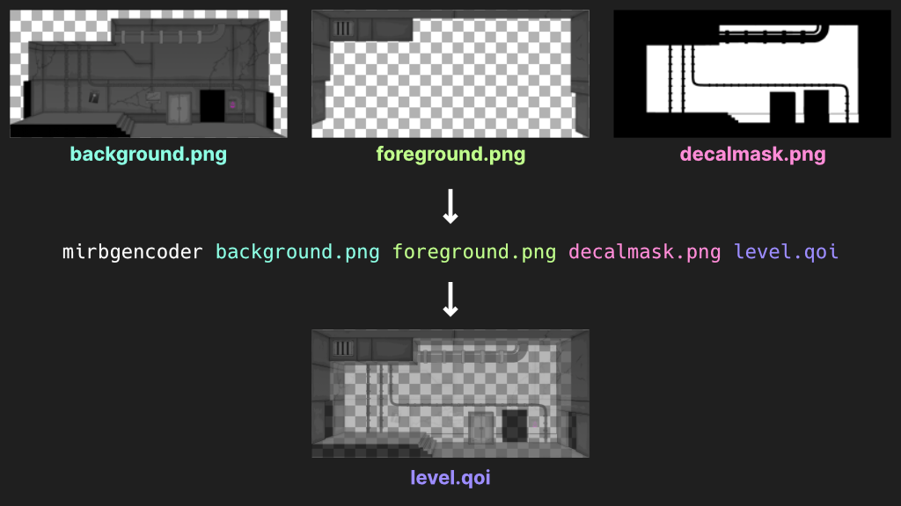

# mirbgencoder (Madness Interactive Reloaded Background Encoder)

This little program packs three image files into a single background image file to be read by Madness Interactive Reloaded.

## Usage:

    mirbgencoder.exe [path to background image] [path to foreground image] [path to decal mask] [output file]

    eg.

    mirbgencoder "Annihilation/background.png" "Annihilation/foreground.png" "Annihilation/decalmask.png" annihilation.qoi

The background is the image behind the player, everything else is transparent.
The foreground is the image in front of the player, everything else is transparent.
The decal mask is a black and white mask, where white represents the areas on the background image where large decals (eg blood splatters) are visible.

The output image is a combination of all of these, utilising the alpha channel. This image can be used in the MIR level editor.

## Constraints:

- It supports most image formats, but ideally the input images should be PNG or QOI for lossless transparency
- The output file should always end with `.qoi`, as it is encoded as a QOI